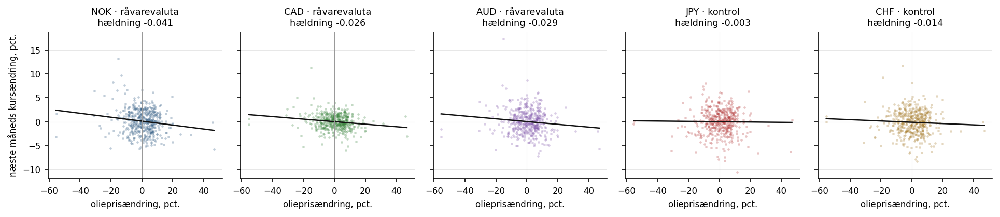
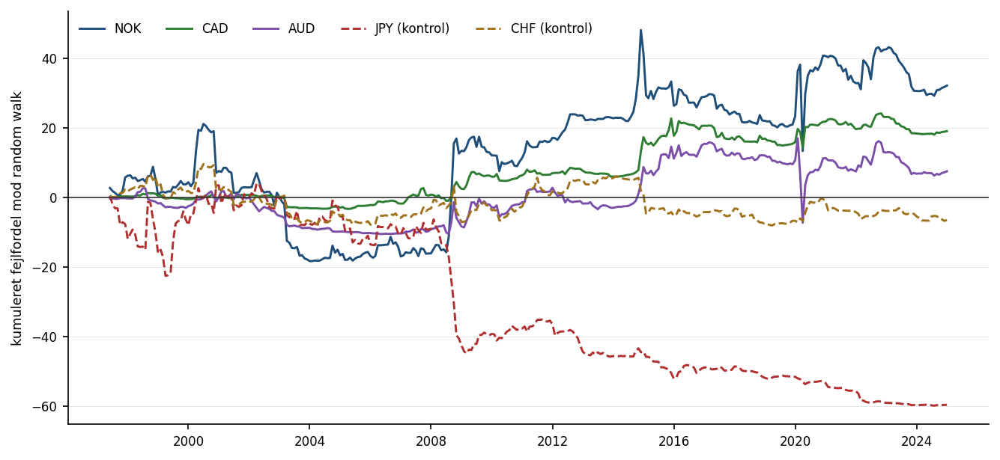

# Kan noget slå en random walk på valutakurser?

Jeg lavede det her projekt efter at have søgt en stilling i Global Research hos
Danske Bank, hvor arbejdet handler om valutamarkedet og makroøkonomi. Det er
bygget over samme spørgsmål som mit forrige projekt om aktieafkast, bare flyttet
til valuta: kan nogle få variable overhovedet sige noget om kursændringen næste
måned?

Det korte svar er nej for tyve af femogtyve modeller. Men der er ét mønster, der
ikke ligner tilfældigheder: olieprisen slår en random walk for alle tre
råvarevalutaer og taber for begge kontrolvalutaer. Formålet var ikke at finde
noget der tjener penge, men at sætte opgaven ordentligt op og se hvad der kommer
ud af det.

## Hvad projektet gør

Fire variable bruges til at forudsige næste måneds ændring i valutakursen. Hver
variabel testes for sig, og til sidst alle fire i samme regression.

Kurserne er noteret som udenlandsk valuta per dollar, så en stigning betyder en
stærkere dollar. Positivt forventet fortegn betyder derfor "denne variabel
varsler en stærkere dollar".

| Variabel | Begrundelse | Forventet fortegn |
|---|---|---|
| Olieprisændring | Dyrere olie styrker en olieeksportørs valuta og svækker dollaren over for den | Negativt for NOK, CAD, AUD |
| Olieprisændring | Japan og Schweiz importerer olie, så dyrere olie burde svække dem | Positivt for JPY, CHF |
| Momentum, 12 måneder | Valutatrends har historisk haft en tendens til at fortsætte | Positivt |
| Afvigelse fra 60-måneders gennemsnit | Kurser langt fra deres eget niveau trækker tilbage | Negativt |
| Ændring i amerikansk 10-årig rente | Stigende amerikanske renter trækker kapital mod dollaren | Positivt |

Fortegnene står i `data.py` og er skrevet ned før modellerne blev kørt.

Tre af valutaerne er råvarevalutaer, og to er kontroller uden nogen oplagt
forbindelse til olieprisen. Kontrollerne er med, fordi et resultat for NOK ikke
betyder noget, hvis det samme dukker op for schweizerfranc.

## Data

Månedlige valutakurser fra Federal Reserves H.10, oliepris på Brent, og
amerikansk 10-årig statsrente. Perioden er 1987-06 til 2025-01, i alt 452
måneder per valuta. Starten er sat af olieprisserien, slutningen af renteserien.
De første 120 måneder går til at estimere de første modeller, så prognoserne
testes på 332 måneder fra 1997 og frem.

Alle tre serier er markedspriser, man kunne aflæse samme dag. Der er derfor
ingen offentliggørelsesforsinkelse at tage højde for, i modsætning til mit
aktieprojekt, hvor inflationstallet for en måned først kommer måneden efter og
skulle forskydes en ekstra måned.

Renteserien i kilden indeholder den samme række stablet tre gange. Seks måneder
afviger med 0,01 procentpoint mellem kopierne, hvilket er afrunding, og der
tages medianen. Den sidste måned i filen afviger med 0,21 og er en ufuldstændig
opgørelse; den kasseres. `data.py` fejler hellere end at gætte, hvis uenigheden
er større end afrunding.

## Metode

Modellerne er almindelige lineære regressioner. Variablen som den så ud ved
udgangen af en måned, mod den kursændring der kom måneden efter.

Prognoserne laves med udvidende vindue. For hver måned estimeres modellen på alt
data til og med den måned, og bruges så til at forudsige den næste. Det gentages
332 gange per valuta. Ingen model ser data der ligger efter det tidspunkt den er
lavet på.

Referencen er en random walk: prognosen for næste måneds ændring er nul. Det er
den benchmark Meese og Rogoff brugte, og den er hårdere end det historiske
gennemsnit, fordi valutakurser stort set ingen drift har. Begge rapporteres.

Resultatet måles som ud-af-stikprøve R² mod referencen: hvor meget mindre bliver
modellens samlede kvadrerede fejl. Positiv betyder at modellen slår referencen,
negativ at man havde været bedre stillet uden den.



Figuren viser olieprisændringen mod næste måneds kursændring for hver valuta.
Punktskyerne er meget spredte, som de skal være. Hældningen er negativ for alle
fem, men den er tre til ti gange større for råvarevalutaerne end for
kontrollerne.

Det er i øvrigt en af mine forventninger, der ikke holdt. Jeg havde skrevet ned,
at fortegnet skulle være positivt for Japan og Schweiz, fordi de importerer
olie. Det er negativt for dem også. Olieprisen er tilsyneladende delvist en
bred dollarfaktor og ikke kun en råvarefaktor. Det, der holder, er
størrelsesordenen, ikke fortegnsskiftet.

## Resultater

Ud-af-stikprøve R² mod random walk, i procent.

| Valuta | Olie | Momentum | Afvigelse | US-rente | Alle fire |
|---|---:|---:|---:|---:|---:|
| NOK | **+1,45** | −0,64 | −0,93 | −1,00 | −0,84 |
| CAD | **+1,80** | −1,23 | −0,63 | −0,79 | −0,19 |
| AUD | **+0,31** | −1,09 | −1,40 | −0,66 | −1,28 |
| JPY | −3,07 | +0,87 | −1,27 | +0,59 | −1,93 |
| CHF | −0,38 | −0,95 | −0,88 | −1,71 | −4,12 |

Oliemodellen slår random walk for alle tre råvarevalutaer og taber for begge
kontroller. Det er det eneste mønster i tabellen, der følger noget, jeg havde
skrevet ned på forhånd.

Modellen med alle fire variable er dårligere end den bedste enkelte variabel for
alle fem valutaer. Den skal estimere fem parametre i stedet for to på det samme
datasæt, og usikkerheden på de ekstra parametre koster mere end variablene
bidrager. Det er det samme, jeg fandt for aktieafkast.

De to positive tal for JPY skal man ikke læse for meget ind i. Momentum giver
+0,87 for yen og negativt for alle fire andre, og der er ikke nogen grund til at
tro, at yen skulle være anderledes.



Figuren lægger fejlforskellen sammen måned for måned, så man kan se hvornår
oliemodellen var bedre end en random walk. Det er her, resultatet bliver mindre
imponerende: næsten hele fordelen kommer i tre spring, i efteråret 2008, ved
oliekrakket i 2014-15 og i marts 2020. Mellem chokkene er kurverne flade eller
svagt faldende.

Modellen fanger altså ikke en løbende sammenhæng. Den fanger, at når olieprisen
falder tredive procent på en måned, så følger de valutaer med. Det er rigtigt,
men det er også omtrent det, man ville gætte uden en model. Fordelt per måned er
det et R² på halvandet procent, hvilket i praksis er meget lidt.

## Begrænsninger

Der er ingen signifikanstest. Jeg sammenligner to modellers fejl, men tester
ikke om forskellen er statistisk sikker. Den korrekte test for indlejrede
modeller er Clark og Wests MSPE-justerede statistik. En almindelig t-test på
fejldifferencerne er ikke gyldig her.

Jeg tester femogtyve kombinationer af valuta og model. Med så mange forsøg vil
et par positive tal dukke op af sig selv. Det er derfor jeg lægger vægt på, at
olieresultatet fordeler sig efter råvarevaluta mod kontrol, og ikke på at tallet
er positivt.

Der er ingen økonomisk vurdering. Et R² på 1,45 procent siger ikke, om der er
penge i det efter handelsomkostninger, og det havde krævet et bud på, hvad man
faktisk ville handle.

Kun en måneds horisont. Litteraturen finder stærkere sammenhænge på længere
sigt, men det kræver en anden håndtering af overlappende observationer.

Der er ingen carry i modellen. Renteforskellen mellem to lande er den mest
oplagte valutavariabel af alle, og den er ikke med, fordi jeg kun har den
amerikanske rente i de data jeg kunne hente. Det er den første ting, jeg ville
tilføje.

## Test

Testene i `tests/` tjekker, at ingen model bruger data fra fremtiden. Den
vigtigste kører hele beregningen to gange, en gang på det fulde datasæt og en
gang på et datasæt der er klippet af i 2010. Alle prognoser fra før 2010 skal
være ens i de to kørsler.

Derudover tjekkes at målet er næste måneds ændring og ikke den forrige, at ingen
variabel korrelerer mistænkeligt højt med det den skal forudsige, at antallet af
prognoser svarer til observationer minus estimationsvinduet, og at renteserien
er entydig efter dublethåndteringen.

## Sådan kører du det

```bash
pip install -r requirements.txt
python koer.py              # skriver resultater.csv, prognoser.csv, fortegn.csv og figurerne
python -m pytest tests -q
```

```
data.py      indlæsning, dublethåndtering og de fire variable
model.py     rullende prognoser og evaluering
figurer.py   figurerne
koer.py      kører det hele
tests/       tester at ingen model ser data fra fremtiden
data/        de tre kildefiler
```

## Kilder

Meese, R. og Rogoff, K. (1983): *Empirical Exchange Rate Models of the Seventies:
Do They Fit Out of Sample?*, Journal of International Economics 14(1). Resultatet
om at random walk er svær at slå stammer herfra.

Chen, Y., Rogoff, K. og Rossi, B. (2010): *Can Exchange Rates Forecast Commodity
Prices?*, Quarterly Journal of Economics 125(3). De finder, at sammenhængen
mellem råvarevalutaer og råvarepriser er stærkest den anden vej rundt end den,
jeg tester her.

Welch, I. og Goyal, A. (2008): *A Comprehensive Look at the Empirical Performance
of Equity Premium Prediction*, Review of Financial Studies 21(4). Opsætningen med
udvidende vindue og ud-af-stikprøve R² er den samme som der.

Data: Federal Reserve H.10 valutakurser, Brent-oliepris og amerikansk 10-årig
statsrente, hentet fra de åbne datasæt i `datasets`-organisationen på GitHub.
